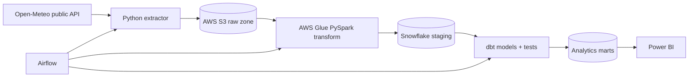

# Cloud Data Warehouse and dbt Analytics Platform

A portfolio implementation of an ELT platform that extracts public API data to an S3-style raw zone, transforms records with an AWS Glue-compatible PySpark job, loads Snowflake, and builds tested analytics marts with dbt. Airflow coordinates the workflow; Power BI can connect to the final marts.

## Architecture



## Repository contents

- Idempotent API extraction with ingestion metadata
- Partitioned raw-zone paths
- Glue-compatible PySpark transformation
- Snowflake DDL and loading examples
- dbt staging, intermediate, and mart layers
- Generic and singular data-quality tests
- Airflow DAG with retries and dependencies
- Local DuckDB profile for reviewing dbt logic without cloud credentials
- CI for Python and dbt validation

## Local demonstration

```bash
python -m venv .venv
source .venv/bin/activate
pip install -r requirements.txt
python src/extract_weather.py --output data/raw
pytest
```

For local dbt development:

```bash
cd dbt_warehouse
dbt deps --profiles-dir profiles
dbt build --target local --profiles-dir profiles
```

## Cloud deployment

1. Copy `.env.example` to `.env` and supply your own development credentials.
2. Create the S3 bucket and Snowflake database/schema.
3. Upload `glue/jobs/transform_weather.py` as an AWS Glue job.
4. Configure Airflow connections for AWS and Snowflake.
5. Run `weather_warehouse_daily`.

Never commit secrets. Use an IAM role for Glue and a Snowflake key-pair or secret manager in real deployments.

## dbt layers

- `staging`: renames and types source columns
- `intermediate`: applies reusable business logic
- `marts`: exposes daily city-level weather metrics for BI

## Data quality

Tests cover uniqueness, not-null constraints, accepted values, relationships, temperature ranges, and source freshness. The project demonstrates how anomalies are blocked; it does not claim a fixed anomaly-catch percentage without a labeled evaluation dataset.

## Power BI

Connect Power BI to `ANALYTICS.MART_DAILY_CITY_WEATHER`. Recommended visuals and measures are documented in `powerbi/README.md`.

## License

MIT
